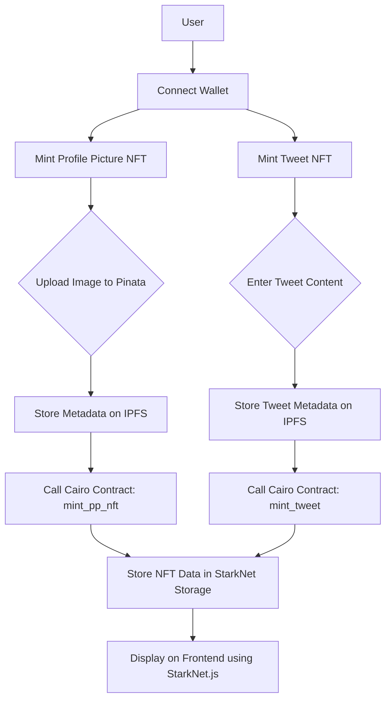

# StarkTweet: A Decentralized Tweeting Platform on StarkNet

## 🧠 Introduction

**StarkNet**, a zk-rollup Layer 2 solution built on Ethereum, enables scalability, transparency, and low-cost transactions while retaining the security of Ethereum. Utilizing **STARKs** (Scalable Transparent Argument of Knowledge), StarkNet provides a cryptographic guarantee of validity without relying on trusted setups, and remains secure even against quantum attacks. It is powered by **Cairo**, a Turing-complete language designed specifically for writing zk-friendly smart contracts.

Amid this context, we introduce **StarkTweet**, a fully on-chain, decentralized microblogging platform where users can share tweets, media, likes, and manage their identity, all via cryptographic verification and smart contracts. Built with **Cairo 1.0**, **StarkNet.js**, and **Pinata/IPFS**, StarkTweet combines the best of decentralized infrastructure with the social expressiveness of Web2.

This document serves as a comprehensive guide to StarkTweet’s architecture, functionalities, storage logic, and development journey. We aim to highlight how zk-rollups and StarkNet can enable scalable, censorship-resistant, user-owned social networks.

---

## 🚀 Why StarkTweet?

Social media has long been monopolized by centralized tech giants, where algorithms control what users see, and user data is monetized with little to no transparency. Worse, users do not truly own their content, which is stored in centralized databases that can be modified or deleted at any time.

**StarkTweet** seeks to solve these issues by building an alternative social network with the following key goals:

1. **Content Ownership**: All tweets and media are minted as NFTs, enabling full ownership and traceability.
2. **Decentralized Storage**: Media and metadata are stored on IPFS via **Pinata**, ensuring they remain accessible and immutable.
3. **User Sovereignty**: Every interaction, from tweeting to liking, is fully on-chain and user-signed, giving users complete control over their digital actions.
4. **zk-Scalability**: Leveraging **StarkNet's** zk-rollups, the platform achieves high throughput at minimal cost.

---

## ✨ Core Features

### 📱 Profile Pictures as NFTs

Users can set and own their profile pictures as NFTs. Images are uploaded to IPFS, and the associated metadata URI is minted through Cairo smart contracts.

### 📲 Tweets as On-Chain Data

Tweets can be posted as plain text or as media-rich content. Each tweet is timestamped, associated with the author, and stored using Cairo 1.0 maps.

### 📷 Media Tweets Minted as NFTs

Media tweets go beyond text by minting the tweet and its media content (stored on IPFS) as NFTs. This feature ensures traceable content ownership.

### ⬆️ Like Mechanism

Users can like tweets on-chain. The platform ensures a user can only like a tweet once, preventing spam and manipulation.

### 📉 Scalable Infrastructure on StarkNet

Thanks to zk-rollups, thousands of transactions can be bundled and verified efficiently using STARK proofs, drastically reducing gas fees and congestion.

### 🌐 IPFS Integration via Pinata

IPFS, managed through the Pinata API, stores media content. Metadata URIs are referenced within smart contracts, enabling decentralized file access.

---

## ⚙️ Contract Deployment Details

* **Contract Address**: `0x041ee9a8e806d04256c40fe24394ce2eb7c4c6a57aabbaa495b4a15d9de812b6`
* **Class Hash**: `0x01341290dbd7323ef30cf3b1bf59a4d9ff7da8d9465206411c0ccce75f1ee6b3`
* **Programming Language**: Cairo 1.0
* **Deployed Using**: Starkli
* **Network**: StarkNet Testnet

---

## 🔍 Smart Contract 

### Profile Management

* `user_profile(name: felt252)`: Sets the user’s display name.
* `set_profile_picture(uri: felt252)`: Uploads a picture to IPFS and mints it as an NFT.
* `get_profile_picture(addr)`: Fetches a user’s profile picture URI.
* `get_name(addr)`: Fetches the user’s display name.

### Tweet Management

* `create_tweet(tweet: felt252)`: Posts a basic text tweet.
* `create_tweet_with_media(tweet: felt252, media_uri: felt252)`: Posts a media tweet as an NFT.
* `get_tweets(addr)`: Returns all tweets by a user.
* `get_all_tweets(start_idx, limit)`: Paginates global tweets.
* `get_global_tweet_count()`: Returns total number of tweets on the platform.

### Engagement

* `like_tweet(tweet_id: u32)`: Likes a specific tweet.
* `get_tweet_likes(tweet_id: u32)`: Gets the number of likes.
* `get_has_liked_tweet(user, tweet_id)`: Verifies if a user liked a tweet.
* `get_tweet_with_media(tweet_id)`: Fetches tweet content and media URI.

---

## 🔄 System Architecture

---

## 🔧 Technical Design

### Storage Layout

* `Map<ContractAddress, felt252>`: Stores usernames.
* `Map<(ContractAddress, u32), felt252>`: Stores user-specific tweets.
* `Map<u32, (ContractAddress, felt252)>`: Stores global tweets.
* `Map<u32, felt252>`: Stores media URIs.
* `Map<ContractAddress, felt252>`: Stores profile picture URIs.
* `Map<u32, u32>`: Stores like counts per tweet.
* `Map<(ContractAddress, u32), bool>`: Tracks whether a user has liked a tweet.

### NFT Logic

* **ERC721 Implementation**:

  * Profile pictures and media tweets are minted as NFTs.
  * `safe_mint` assigns ownership.
  * Metadata URIs reference Pinata-hosted files.

### Events

Emit logs for frontend listeners and analytics:

* `TweetCreated`
* `MediaTweetCreated`
* `TweetLiked`
* `ProfilePictureSet`

### Security Measures

* Prevents multiple likes by the same user.
* Ensures tweet existence before interaction.
* Optimized tweet indexing for pagination.

---

## ✨ User Flow Example

### 1. Sign Up & Set Profile

* Connect via StarkNet wallet (e.g., ArgentX).
* Set a username with `user_profile`.
* Upload and mint profile pic via `set_profile_picture`.

### 2. Tweet

* Input tweet text.
* If media is attached, upload via frontend to IPFS.
* Call `create_tweet_with_media` or `create_tweet`.

### 3. Explore Feed

* Load global tweets with `get_all_tweets(start, limit)`.
* Fetch associated media from IPFS.

### 4. Engage

* Like tweets using `like_tweet`.
* View like count with `get_tweet_likes`.

---

## ⚛️ Frontend Overview

* **Framework**: React + StarkNet.js
* **Wallet Support**: Argent X, Braavos
* **Media Handling**: Pinata for IPFS uploads

### UI Screens

* Wallet Connect & Auth
* Profile Dashboard
* Tweet Feed
* Tweet Composer
* Like Interactions

### Developer Notes

* Use StarkNet.js `Provider`, `Contract`, and `Account` objects.
* Load contracts with ABI and class hash.
* Connect via user wallet and call view/invoke functions.

---

## ⚡ Deployment & Testing

* **Network**: StarkNet Testnet (use Sepolia Starks)
* **Local Testing**: Devnet or Katana
* **Frontend IPFS Uploads**: Pinata test keys
* **Frontend Integration**: Tested with StarkNet.js 5+

### Testing Tools

* StarkNet CLI
* StarkNet.js Playground
* Postman for Pinata API
* Vercel for frontend deployment

---

## 🏆 Roadmap & Future Plans

* ✏️ **Comments & Threads**: Enable nested replies.
* 🌎 **Retweets/Quote Tweets**: Propagation and remix of content.
* 🏠 **NFT Marketplace**: List and trade media tweets.
* 🔒 **zkSNARK Authors**: Hide identity of tweet authors for privacy.
* 📈 **DAO Moderation**: Community-led governance.
* ✨ **Mobile App**: Cross-platform mobile clients.

---

## Working Video

https://github.com/user-attachments/assets/49d80e70-605a-4d1e-97b7-599831ef81da

---

## 🌐 Open Source & Community

* **Status**: Actively maintained

---

## 🧑‍💻 Contact & Collaboration

For queries, collaborations, or contributions:

* Email: `adityakumar41205@gmail.com`
* Twitter: `@Adityaalchemist`

Made with ❤️ on StarkNet
